# 🚚 **Otonom Kargo Aracı**

Bu proje, **düşük maliyetli donanım** ve **gelişmiş makine öğrenmesi algoritmaları** ile belirli bir ortamda (kendi sokaklarında) otonom hareket edebilen bir kargo aracı geliştirmeyi hedefler. Sistem, bir kamera aracılığıyla **şerit ve engel tespiti** yaparak güvenli ve akıllı bir şekilde yol alabilir.

---

## ✨ **Temel Özellikler**

- **Otonom Sürüş**: Gelişmiş bir CNN modeli (UFLD veya benzeri) kullanarak **şeritleri ve yol çizgilerini gerçek zamanlı olarak takip etme**.  
- **Dinamik Engel Algılama**: Önündeki engelleri algılayıp, çarpmayı önlemek için **otomatik yön değiştirme**.  
- **Verimli Motor Kontrolü**: Arduino Nano, L298M motor sürücüler ve 3 motor (2 arka, 1 ön) ile aracın hareketini **hassas bir şekilde yönetme**.  
- **Modüler Yazılım Mimarisi**: Python ve PyCharm üzerinde geliştirilen kod, **donanım kontrolü ile ayrıştırılmış, düzenli bir yapıya sahip**.  

---

## ⚙️ **Sistem Mimarisi**

Sistem, görevleri farklı katmanlara ayırarak **anlaşılır ve yönetilebilir bir yapı** sunar:

1. **Görüntü İşleme Katmanı**: Kamera ile alınan video akışı, **şerit ve engel tespiti için Python tabanlı ML modellerine** gönderilir.  
2. **Karar Katmanı**: İşlenen veriler doğrultusunda, aracın hangi yöne gitmesi veya durması gerektiğine karar verilir.  
3. **Donanım Kontrol Katmanı**: Alınan kararlar, **Arduino Nano'ya seri port üzerinden** gönderilir.  
4. **Fiziksel Hareket Katmanı**: Arduino, gelen komutlara göre **motor sürücülerini ve motorları** kontrol ederek aracı hareket ettirir.  

### Sistem Akış Diyagramı

```mermaid
graph TD
    A[Kamera Görüntüsü] --> B(Python İşleme ve ML Modeli)
    B --> C{Karar Mantığı}
    C --> D[Arduino Nano]
    D --> E[Motor Sürücüleri ve Motorlar]


```

🛠️ Kurulum
1️⃣ Donanım Bağlantısı

Arduino Nano, 3 motor ve L298M motor sürücüleri arasındaki bağlantıları şemaya uygun şekilde yapın.

2️⃣ Yazılım Kurulumu

Python 3.x yüklü olduğundan emin olun.
Projeyi klonlayın:

git clone https://github.com/KULLANICIADINIZ/otonomkargoaraci.git
cd otonomkargoaraci

3️⃣ Model Ağırlıkları

Makine öğrenmesi modeli için gerekli ağırlıkları models/ klasörüne indirin.

4️⃣ Aracı Başlatma
python main.py

Bu komut, kamerayı başlatır ve aracı otonom olarak hareket ettirir.
